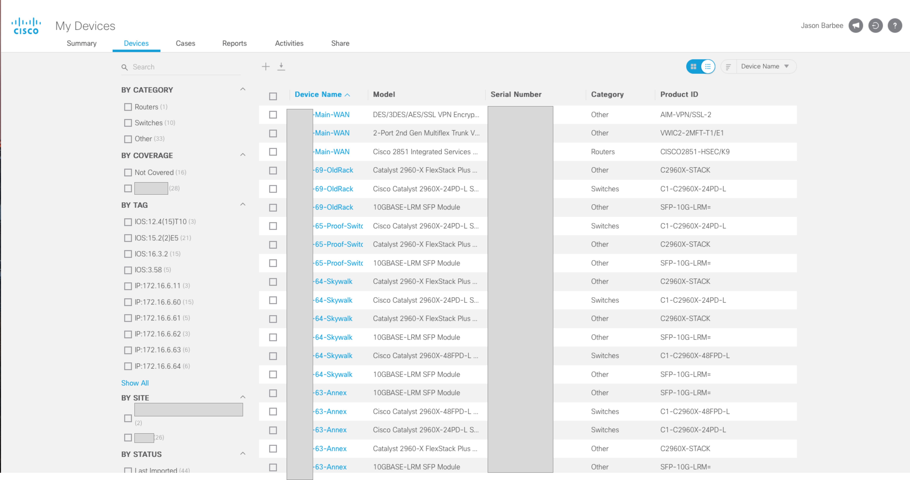
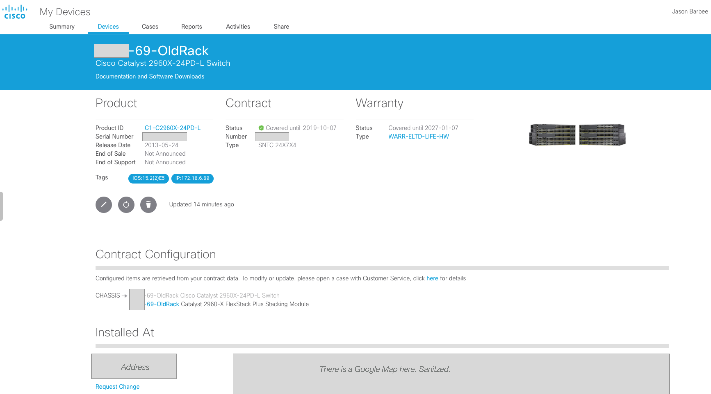
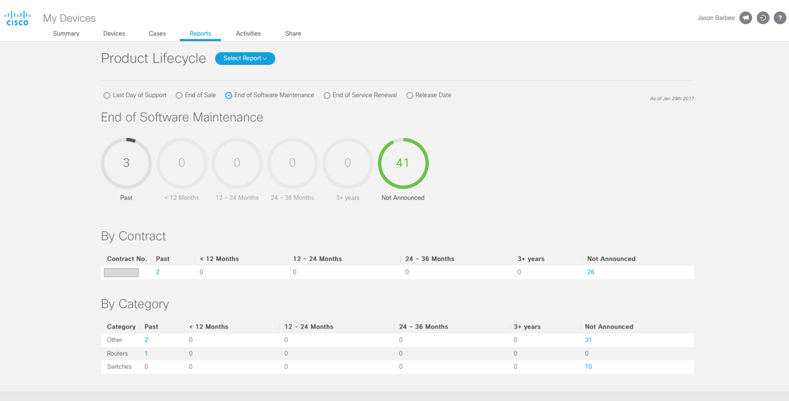
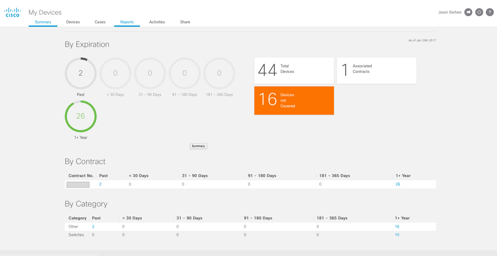
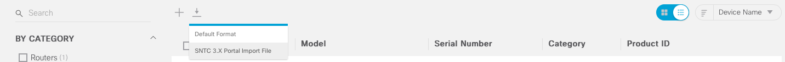

# Ansible Cisco Inventory

## Cisco Assessment Toolkit
### Features:
* Inventory
    * Routers
    * Switches
    * UCS FI,Chassis,Compute resources.
    * Callmanager Devices (coming soon)
* SNMP Discovery and Graphing
* Mass configuration changes
* Export to Cisco My Devices + Cisco Smartnet Totalcare
* Ansible with NTC-Ansible preloaded.

## Why use this?
1. No SNMP or discovery, no collector required.
2. Future Automation - Ansible is a powerful automation tool.
3. Inventory isolation - No data leaves the network other than the CSV.
4. Cisco My Devices - EOX reports and contract renewal quoting for customers.
5. Cisco My Devices - IOS version reports. Soon suggested versions, PSIRTs, and defer notices.
6. Export data to Cisco Totalcare using this toolset.
7. Assessment tooling to run mass commands and backups for auditing your network.

## Manual Install is at the bottom of the page.

## Docker - the easy way
I built a Docker image that has everything pre-built and ready to run all tooling.
It will export all files on /mnt, to your mounted folder you pass to Docker.
*Do not save anything inside Docker!*

Copy your inventory to /mnt like below, and edit it on your local machine outside of docker.

```
docker pull jasonbarbee/ansible-cisco-inventory
docker run --net=host -it -v $(pwd):/mnt jasonbarbee/ansible-cisco-inventory:latest
cp /ansible/inventory.yml /mnt/inventory.yml
ansible-playbook -i /mnt/inventory.yml ios-inventory.yml

```
Quick explanation of what's going on there- 
-v mounts a local folder as a volume
$(pwd) returns the local path you are in to mount it to the /mnt folder inside docker.
the -it calls for an interactive session (bash shell)
CAUTION: If you are new to Docker.... Docker containers do not SAVE any data except in the shared volume area.

Let's say you have a folder on your desktop for inventories. You can mount that and use the Docker Ansbile to reference that, and just run the host file inventory tool inside the container.

Docker will write a mydevices.csv file inside the container. This will not persist past your session, you must copy this out. 
I plan to address this in the near future with a environment variable...TODO.

For now, take the mydevices.csv output and copy it to the mount folder.

```
cp mydevices.csv /mnt
```

# Discover and Diagram a network
The Docker image is preloaded with MNet. This will scan the network via a root node, scan each CDP neighbor and build a decent diagram of the network.

Look in the /mnet folder
Edit the mnet.conf with your SNMP Strings and exclusion information. 
VI is included in the docker image for easy editing. 

Usage:
```
cd /mnet
./mnet.py graph -t MyCustomer -f /mnt/mycustomer.svg -r 192.168.1.1 -c mnet.conf
```
Make sure to use the /mnt path so the diagram will export to your mounted folder outside docker.

Diagram Example


# Discover a network to build an Ansible File of the devices found.
Run MNET Above but add a parameter to write discovered data to CSV.
```
cd /mnet
./mnet.py graph -t MyCustomer -f /mnt/mycustomer.svg -r 192.168.1.1 -c mnet.conf -C /mnt/mnet-discovered.csv
```
Now - convert that to Ansible format
```
./mnet2ansible.py -i /mnt/mnet-discovered.csv -o /mnt/discovered-inventory.yml
```

You will get a file like this
```yaml
[discovered]
10.10.10.10
10.10.10.11
10.10.10.11
```

# Now to Configure Ansible
I am using Ansible as a CLI parsing tool. So as long as we can login via SSH, we are good. Even telnet in some cases.
Most modules **require SSH**. 
You can use Ansible and Telnet to provision SSH if you are lacking.

An example - config playbook (config-ssh.yml) is included if you need some guidance on bulk enabling ssh through telnet.

Getting Started:
1. ansible.cfg should be ntc-ansible folder. It forces the library folder local for NTC-Ansible to load in the same folder. It's automatically loaded in the Docker image, and on this repo.
2. Onboard devices with Ansible inventory file
Mode Basic Example
```yaml
[routers]
192.168.1.1

[all:vars]
username='username'
password='password'
port=22
client='MyClientName'
connection='ssh'
port=22
```
A more common example is pre-loaded in the repo to allow you to group things together.
Like calling "routers" to include all your telnetrouters and ssh routers like this.
Just fill in the IPs and use the framework provided.

```yaml
[sshrouters]
192.168.1.1

[sshrouters:vars]
port=22
connection='ssh'
platform='cisco_ios_ssh'

[telnetrouters]
192.168.1.2 

[telnetrouters:vars]
connection='telnet'
platform='cisco_ios'
port=23

[routers:children]
sshrouters
telnetrouters

[routers:vars]
username='username'
password='password'
```

# UCS Inventory
To export a UCS inventory, which also works with Cisco My Devices - 
Edit your inventory.yml file with something like this, example in the repo here.
```yaml
[ucs]
192.168.1.3

[ucs:vars]
ucs_username='admin'
ucs_password='secret'
```

```bash
$ ansible-playbook -i /mnt/inventory.yml ucs-inventory.yml
```
You will get a file - */mnt/ucs.csv*. This file can be uploaded straight to Cisco My Devices Tool (below)
If using Docker - copy this file off to /mnt (shared folder path)

# Router/Switch Inventory
Scan the network
```bash
$ ansible-playbook -i /mnt/inventory.yml ios-mydevices.yml
```
You will get a file - */mnt/mydevices.csv*. This file can be uploaded straight to Cisco My Devices Tool (below)
If using Docker - copy the configs OFF the Image to /mnt (shared folder path)

## Uploading to Cisco MyDevices
## [Cisco MyDevices Tool](https://cway.cisco.com/mydevices/)

* Choose Add New Devices and Import using the CSV Template option.
( Don't worry about duplicates, or all the module serial numbers. It will be helpful in the reports.) 

# You can capture more data if you want.
### Customizing Options Tags and Notes fields:
1. open up the cisco-mydevices.yml file
2. collect the data you want (this may include using other playbooks)
3. Include the variable in the has string and again in the CSV parsing output.

I am capturing 2 "TAGS" - Version, and IP Address in the default code.

* Now you can run EOX reports on any Device or module in the entire scan!
* You can also share your Device Information with up to 15 other people for smartnet quoting or rough inventory review.

## See all your Inventory, modules, Site Address, and Contract info.


## Cisco MyDevice View Per Chassis


## See EOX Reports for your Cisco Network


## See your Contracts at a glance.


# Onboarding to Totalcare
Select all the devices and click Download in SNTC 3.x Format.


Now you can import this file to Totalcare. Setting up Totalcare is beyond the scope here.

# Backup the entire network configs too.
```bash
$ ansible-playbook -i inventory.yml backup-configs.yml
```
If using Docker - copy the configs OFF the Image to /mnt

# FAQ
### SSH won't connect to very old Cisco devices, dhe key is too small
https://www.petenetlive.com/KB/Article/0001245

### Backups Fail for Old Devices?
PyNTC and NTC-Ansible seem to be adding the global_delay_factor in as a parameter. As of 3/1/2017, that is a pending pull-request and not committed yet.
I'm not interested in forking to support an alternate branch in this transition.

Quick fix:

sudo (your-editor) /usr/local/lib/python2.7/dist-packages/pyntc/devices/ios_device.py
Change your block of code for the backup function to this. It just doubles the timer, and works great.
Tested on 2950s, 3560s, 2800s, 3850s, 2960Xs...
```python2
    def backup_running_config(self, filename):
        with open(filename, 'w') as f:
            f.write(self.native.send_command_timing('show running-config'))
            self.native.send_command_timing('\n',delay_factor=2)
            self.native.find_prompt()
        return True
```

### How about Telnet?
Yes - via NTC-Ansible. Many of their modules support telnet, including the ntc_config_command, ntc_show_command. However, ntc_save_config does not support telnet. 

pass in parameters to NTC-Ansible like this
```
connection: 'telnet'
port: 23
```
An example is included in the report as config-ssh.yml

## Manual Install 

## To install on Ubuntu - you need Ansible and NTC-Ansible
1. Install Ansible
http://docs.ansible.com/ansible/intro_installation.html

2. Install NTC-Ansible into the working folder with this playbook.
https://github.com/networktocode/ntc-ansible

    * Option 1 usually works best.
One simple way to fix Ansible paths for this to work is to create a new folder for this repo, then clone this repo into it.
```git clone https://github.com/networktocode/ntc-ansible --recursive```

Example that should work every time
```
$ git clone https://github.com/networktocode/ntc-ansible.git --recursive
$ wget https://github.com/jasonbarbee/ansible-cisco-inventory/archive/master.zip ansible-inventory.zip
$ unzip master.zip
$ cp ansible-cisco-inventory/* ntc-ansible
$ cd ntc-ansible
```

Test your NTC Code library paths. If it does not work, my script will not work. 
If you get a working Help Document from this command you are good to go.
```
$ ansible-doc ntc_file_copy
```

### Install NTC-Ansible Depedencies
```
pip install ntc-ansible
sudo apt-get install zlib1g-dev libxml2-dev libxslt-dev python-dev
pip install terminal
```

## Project Roadmap in Order of Priority
* Export from SNMP discovery to Ansible hosts file.
* Exporting Host data for Cisco CLI Analyzer Tool direct input
* Alternate username/password attempt. 
* Try to make Telnet more comprehensive.
* Network inventory database for persistent storage

## Contributing
I'm open to any pull requests, contact me or submit a pull request and let's make this better.

## Helpful Resources to Learn Ansible Tricks
[Ansible Tricks](http://perfspy.blogspot.com/2016/06/ansible-tricks.html)
[Ansible Language Examples](https://github.com/ansible/ansible-examples)
## License
MIT License
Jason Barbee

## Credits
Many thanks for the following projects used heavily in this toolkit.

* MNet Suite is GPL licensed by Michael Laforest.
https://github.com/MJL85/mnet
* NTC-Ansible is Apache Licensed by Jason Edelman.
* Ansible is GPL v3 licensed. Original creator - Michael DeHaan.
